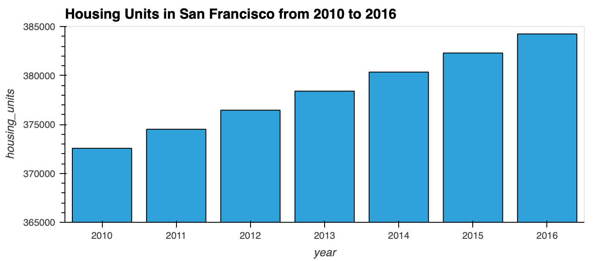
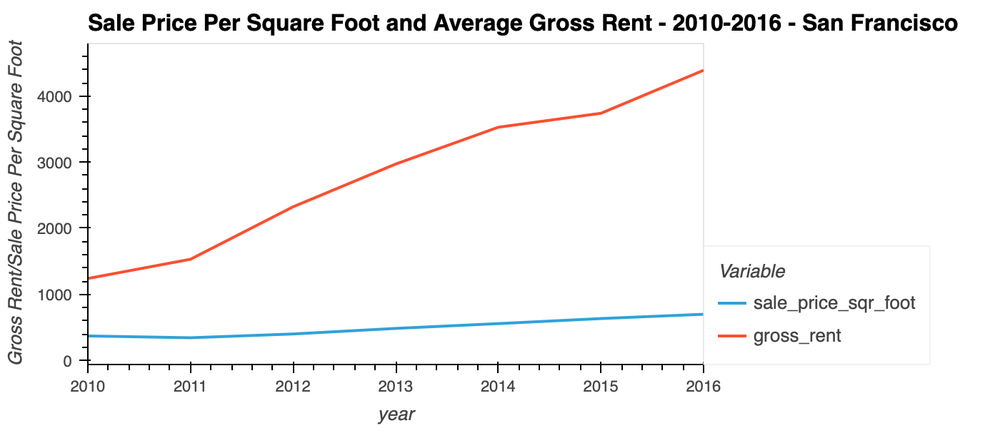
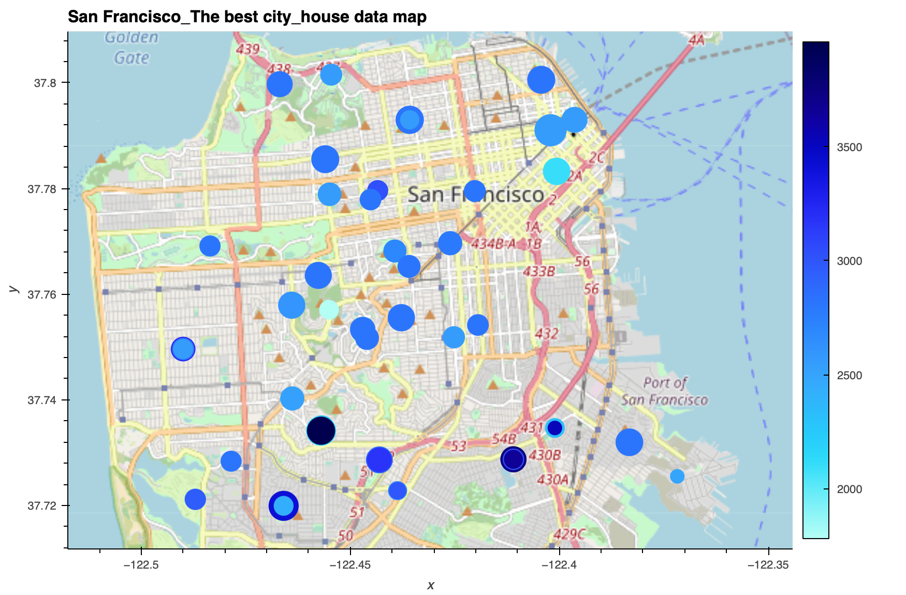

# Module 6
#### San Francisco Property Market Analysis

---

## Technologies

  > * python pandas library   
  > * python pyviz hvplot geoviews

---

## Questions list in the assignment for easily accessing
**Question:** What is the overall trend in housing_units over the period being analyzed?   
> * the overall trend in housing units over the period rises.   
---
**Question:** What is the lowest gross rent reported for the years included in the DataFrame?   
 > * The lowest gross rent is 1239.0   
---
**Question:** Did any year experience a drop in the average sale price per square foot compared to the previous year?   
**Question:** If so, did the gross rent increase or decrease during that year?   
> * Yes, average sale price once drop during 2010 - 2011 due to the numerical analysis     
  > * The gross rent increase during that year    
---
**Question:** For the Anza Vista neighborhood, is the average sale price per square foot for 2016 more or less than the price that’s listed for 2012?      
> * 2016 is less than 2012 of average sale price per square foot     
  > * from the picture we found 2012 price is 344.491 while 2016 is 88.402     
---
**Question:** Which neighborhood has the highest gross rent, and which has the highest sale price per square foot?     
> * Westwood Park has the highest gross rent     
  > * Union Square Distric has the highest sale price per square foot     
---
**Question:**  How does the trend in rental income growth compare to the trend in sales prices? Does this same trend hold true for all the neighborhoods across San Francisco?     
> * the trend in rental prices raises more than trend in sale
  > * most of the neighborhoods share the samilar trends but some neighberhood has a rent growth but a sale decreasement
**Question:** What insights can you share with your company about the potential one-click, buy-and-rent strategy that they're pursuing? Do neighborhoods exist that you would suggest for investment, and why?      
> * due to the data and visualization, the trends of rent increase every year, it is a safe choice to rent the house
  > * most of neiborhood has a slightly sale price growth, however, it is a risk that some neighborhood have a decrease of sale numbers, please hold your investment
---

## Pic referrence

    
    
      
     
```python
all_neighborhoods_df.hvplot.points(
'Lon', 'Lat', geo = True, size = "sale_price_sqr_foot", color = "gross_rent", tiles = "OSM",
frame_width = 700, frame_height = 500, title = "San Francisco_The best city_house data map"
)
```     
     

---

## Contributors

  > Vivian Liu
    Liu Lujunjin

---

## License

> MIT License

Copyright (c) [2022] [Liu Lujunjin]

Permission is hereby granted, free of charge, to any person obtaining a copy of this software and associated documentation files (the "Software"), to deal in the Software without restriction, including without limitation the rights to use, copy, modify, merge, publish, distribute, sublicense, and/or sell copies of the Software, and to permit persons to whom the Software is furnished to do so, subject to the following conditions:

The above copyright notice and this permission notice shall be included in all copies or substantial portions of the Software.

THE SOFTWARE IS PROVIDED "AS IS", WITHOUT WARRANTY OF ANY KIND, EXPRESS OR IMPLIED, INCLUDING BUT NOT LIMITED TO THE WARRANTIES OF MERCHANTABILITY, FITNESS FOR A PARTICULAR PURPOSE AND NONINFRINGEMENT. IN NO EVENT SHALL THE AUTHORS OR COPYRIGHT HOLDERS BE LIABLE FOR ANY CLAIM, DAMAGES OR OTHER LIABILITY, WHETHER IN AN ACTION OF CONTRACT, TORT OR OTHERWISE, ARISING FROM, OUT OF OR IN CONNECTION WITH THE SOFTWARE OR THE USE OR OTHER DEALINGS IN THE SOFTWARE.

